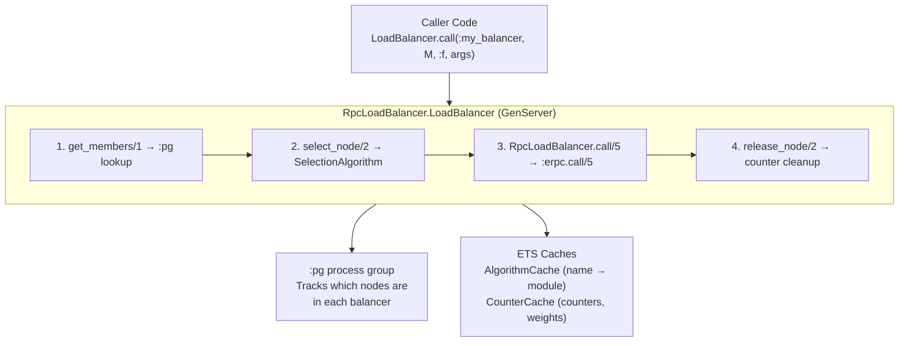
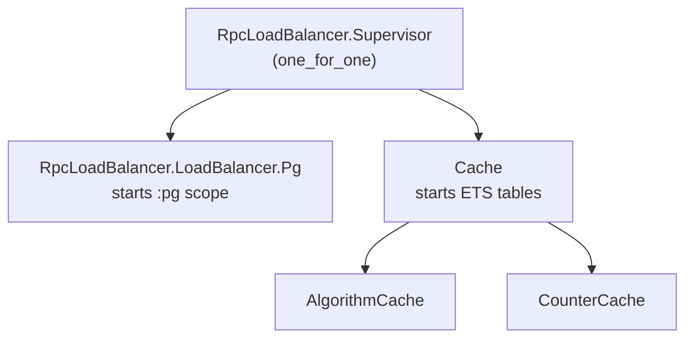

# Architecture and Design Decisions

This document explains the internal architecture of `rpc_load_balancer`, the reasoning behind key design choices, and how the components fit together.

## Why this library exists

Erlang's `:erpc` module provides low-level RPC primitives, but using it directly in application code has friction:

- **No structured errors** — `:erpc` raises Erlang exceptions that need to be caught and translated into meaningful application errors
- **No node management** — callers must know which nodes exist and pick one themselves
- **No load distribution** — without a selection layer, traffic tends to concentrate on whichever node the caller happens to target

`rpc_load_balancer` addresses all three by wrapping `:erpc` with `ErrorMessage` tuples, providing automatic node discovery via `:pg`, and offering pluggable selection algorithms.

## System overview

## Component design

### RPC wrappers (`RpcLoadBalancer`)

The top-level module is intentionally thin. It wraps `:erpc.call/5` and `:erpc.cast/4` in `try/rescue` blocks and maps Erlang errors to `ErrorMessage` structs:

- `{:erpc, :timeout}` → `ErrorMessage.request_timeout/2`
- `{:erpc, :noconnection}` → `ErrorMessage.service_unavailable/2`
- `{:erpc, :badarg}` → `ErrorMessage.bad_request/2`
- Anything else → `ErrorMessage.service_unavailable/2`

This mapping gives callers a consistent `{:ok, result} | {:error, %ErrorMessage{}}` contract without needing to understand `:erpc` internals.

### Load balancer GenServer

Each `LoadBalancer` instance is a GenServer that:

1. **Registers on init** — joins the `:pg` group so other nodes can discover it
2. **Monitors membership** — subscribes to `:pg` join/leave notifications (on OTP 25+ via `:pg.monitor/2`)
3. **Delegates selection** — looks up the algorithm module from `AlgorithmCache` and calls `choose_from_nodes/3`

The GenServer itself holds minimal state: the algorithm module, the node match list, and the `:pg` monitor reference. All shared mutable state (counters, weights) lives in ETS, not in the GenServer's process state. This avoids the GenServer becoming a bottleneck for reads.

### Why `:pg` instead of `:global` or a custom registry

`:pg` was chosen because:

- **Distributed by default** — process groups are replicated across connected nodes automatically
- **No single point of failure** — unlike `:global`, `:pg` doesn't require a leader or lock manager
- **Built into OTP** — no external dependencies needed
- **Scope isolation** — using a named scope (`:rpc_load_balancer`) prevents interference with other `:pg` users

When a load balancer starts on a node, it joins the group. When it stops (or the node goes down), `:pg` removes it. Other balancers with the same name on other nodes see the membership change through their monitor.

### Why ETS caches instead of GenServer state

Counters and algorithm lookups are on the hot path — every `select_node` call reads them. Storing this data in the GenServer's state would serialize all reads through a single process mailbox.

ETS tables with `read_concurrency: true` allow concurrent reads from any process without contention. The `CounterCache` uses `:ets.update_counter/4` for atomic increments, which is both lock-free and safe under concurrent access.

The caches are managed by the `elixir_cache` library, which provides a consistent interface and handles table lifecycle.

### Node filtering

The `:node_match_list` option controls whether the current node joins the `:pg` group. The check happens once during `handle_continue(:register, ...)`:

- `:all` — always joins
- `[patterns]` — joins only if `to_string(node())` matches at least one pattern via `=~`

This is a local decision — each node decides independently whether to register. There's no central coordinator that manages the node list.

## Algorithm design

### The behaviour pattern

All algorithms implement a single required callback (`choose_from_nodes/3`) plus optional lifecycle callbacks. This keeps simple algorithms simple (Random is 3 lines) while letting stateful algorithms hook into the full lifecycle.

The `SelectionAlgorithm` module acts as a dispatch layer that checks `function_exported?/3` before calling optional callbacks. This means algorithms only need to implement the callbacks they actually use.

### Counter-based algorithms

LeastConnections, PowerOfTwo, and RoundRobin all use ETS atomic counters. The key design choice here is that **selection and counter update are not transactional** — there's a window between reading the count and incrementing it where another process could read the same value.

This is acceptable because:

- Perfect accuracy isn't required — load balancing is probabilistic
- The atomic increment itself is safe — no count is lost
- The alternative (locking) would add latency on every selection

### Counter overflow protection

RoundRobin and WeightedRoundRobin reset their counters when they exceed 10,000,000. This prevents the integer from growing unboundedly over the lifetime of a long-running node. The reset is not atomic with the read, but since the counter is used modulo the node count, a brief discontinuity has no practical impact.

### HashRing trade-offs

The current HashRing implementation uses a simple modular hash (`phash2(key, node_count)`) rather than a full consistent hash ring with virtual nodes. This means:

- **Pro** — zero state, zero initialization cost, O(1) selection
- **Con** — when nodes join or leave, most keys remap to different nodes

For use cases that need minimal key redistribution on topology changes, a custom algorithm with virtual nodes would be more appropriate.

## Error handling philosophy

The library uses the `ErrorMessage` library consistently:

- All public functions return `{:ok, result}`, `:ok`, or `{:error, %ErrorMessage{}}` tuples
- Error codes map to HTTP status semantics (`:service_unavailable`, `:request_timeout`, `:bad_request`)
- Error details include the node name and any relevant context in the `:details` field

This design integrates cleanly with Phoenix applications that can pattern-match on `ErrorMessage` codes for HTTP response mapping.

## Supervision tree

Load balancer instances are **not** started by this supervisor — they're expected to be added to the consuming application's supervision tree. This gives the caller control over restart strategies and initialization order.

## Multi-node behaviour

On a cluster with N nodes, each running a load balancer with the same name:

1. Each node's GenServer joins the shared `:pg` group
2. Each node sees all N members (including itself)
3. `select_node/2` on any node can return any of the N nodes
4. RPC calls execute on the selected remote node via `:erpc`

The load balancer is fully symmetric — there's no primary/replica distinction. Every node is both a selector and a potential target.
