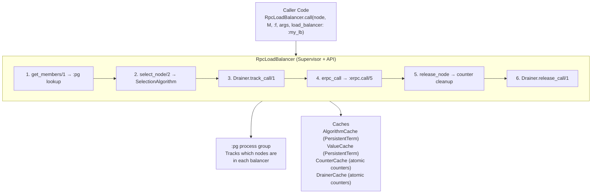
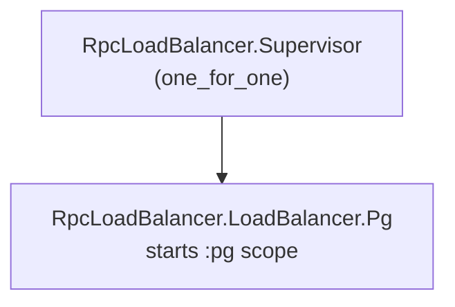
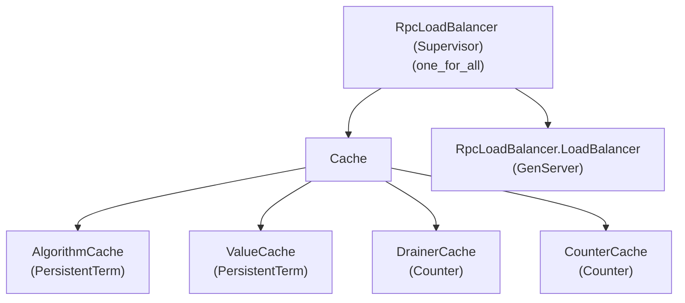

# Architecture and Design Decisions

This document explains the internal architecture of `rpc_load_balancer`, the reasoning behind key design choices, and how the components fit together.

## Why this library exists

Erlang's `:erpc` module provides low-level RPC primitives, but using it directly in application code has friction:

- **No structured errors** — `:erpc` raises Erlang exceptions that need to be caught and translated into meaningful application errors
- **No node management** — callers must know which nodes exist and pick one themselves
- **No load distribution** — without a selection layer, traffic tends to concentrate on whichever node the caller happens to target

`rpc_load_balancer` addresses all three by wrapping `:erpc` with `ErrorMessage` tuples, providing automatic node discovery via `:pg`, and offering pluggable selection algorithms.

## System overview

```mermaid
flowchart TD
    A["Caller Code\nRpcLoadBalancer.call(node, M, :f, args, load_balancer: :my_lb)"] --> B

    subgraph B["RpcLoadBalancer (Supervisor + API)"]
        B1["1. get_members/1 → :pg lookup"]
        B2["2. select_node/2 → SelectionAlgorithm"]
        B3["3. Drainer.track_call/1"]
        B4["4. erpc_call → :erpc.call/5"]
        B5["5. release_node → counter cleanup"]
        B6["6. Drainer.release_call/1"]
        B1 --> B2 --> B3 --> B4 --> B5 --> B6
    end

    B --> C[":pg process group\nTracks which nodes are\nin each balancer"]
    B --> D["Caches\nAlgorithmCache (PersistentTerm)\nValueCache (PersistentTerm)\nCounterCache (atomic counters)\nDrainerCache (atomic counters)"]
```

## Component design

### RPC wrappers and public API (`RpcLoadBalancer`)

The top-level module serves dual roles: it is both a per-instance Supervisor (started via `start_link/1`) and the public API for RPC operations. It wraps `:erpc.call/5` and `:erpc.cast/4` in `try/rescue` blocks and maps Erlang errors to `ErrorMessage` structs:

- `{:erpc, :timeout}` → `ErrorMessage.request_timeout/2`
- `{:erpc, :noconnection}` → `ErrorMessage.service_unavailable/2`
- `{:erpc, :badarg}` → `ErrorMessage.bad_request/2`
- Anything else → `ErrorMessage.service_unavailable/2`

This mapping gives callers a consistent `{:ok, result} | {:error, %ErrorMessage{}}` contract without needing to understand `:erpc` internals.

When `call/5` or `cast/5` receives a `:load_balancer` option, it routes through the named balancer — selecting a node, tracking the in-flight call for draining, executing the RPC, releasing the node's counter, and untracking the call. Without the option, it performs a direct `:erpc` call to the specified node.

### Load balancer GenServer

Each `RpcLoadBalancer.LoadBalancer` instance is a GenServer that:

1. **Registers on init** — joins the `:pg` group so other nodes can discover it (via `handle_continue`)
2. **Monitors membership** — subscribes to `:pg` join/leave notifications (on OTP 25+ via `:pg.monitor/2`)
3. **Drains on shutdown** — leaves the `:pg` group, then waits for in-flight calls to complete (up to `drain_timeout`, default 15s) before terminating

The GenServer itself holds minimal state: the algorithm module, the node match list, the `:pg` monitor reference, and the drain timeout. All shared mutable state (counters, weights, hash rings) lives in caches, not in the GenServer's process state. This avoids the GenServer becoming a bottleneck for reads.

### Why `:pg` instead of `:global` or a custom registry

`:pg` was chosen because:

- **Distributed by default** — process groups are replicated across connected nodes automatically
- **No single point of failure** — unlike `:global`, `:pg` doesn't require a leader or lock manager
- **Built into OTP** — no external dependencies needed
- **Scope isolation** — using a named scope (`:rpc_load_balancer`) prevents interference with other `:pg` users

When a load balancer starts on a node, it joins the group. When it stops (or the node goes down), `:pg` removes it. Other balancers with the same name on other nodes see the membership change through their monitor.

### Why caches instead of GenServer state

Counters and algorithm lookups are on the hot path — every `select_node` call reads them. Storing this data in the GenServer's state would serialize all reads through a single process mailbox.

The library uses two cache strategies via `elixir_cache`:

- **`PersistentTerm`-backed caches** (`AlgorithmCache`, `ValueCache`) — for data that changes infrequently (algorithm modules, hash ring data, weight maps). `PersistentTerm` provides zero-copy reads from any process.
- **Atomic counter caches** (`CounterCache`, `DrainerCache`) — for data that changes on every call (round robin indices, connection counts, in-flight call counts). Uses `:atomics` for lock-free concurrent increments.

### Node filtering

The `:node_match_list` option controls whether the current node joins the `:pg` group. The check happens once during `handle_continue(:register, ...)`:

- `:all` — always joins
- `[patterns]` — joins only if `to_string(node())` matches at least one pattern via `=~`

This is a local decision — each node decides independently whether to register. There's no central coordinator that manages the node list.

### Connection draining

The `Drainer` module tracks in-flight calls using an atomic counter per load balancer name. When a load-balanced `call/5` or `cast/5` executes, the counter is incremented before the RPC and decremented after (in an `after` block to ensure cleanup on errors). During shutdown, the GenServer's `terminate/2` callback calls `Drainer.drain/2`, which polls the counter every 50ms until it reaches zero or the timeout expires.

### Random-node helpers

`call_on_random_node/5` and `cast_on_random_node/5` provide a simpler routing mechanism that doesn't require a load balancer instance. They filter `Node.list/0` by a substring match and pick a random matching node. If no nodes match, they retry automatically (configurable via `Retry`). If the current node matches the filter or `:call_directly?` is `true`, they execute locally.

## Algorithm design

### The behaviour pattern

All algorithms implement a single required callback (`choose_from_nodes/3`) plus optional lifecycle callbacks. This keeps simple algorithms simple (Random is 3 lines) while letting stateful algorithms hook into the full lifecycle.

The `SelectionAlgorithm` module acts as a dispatch layer that checks `function_exported?/3` before calling optional callbacks. This means algorithms only need to implement the callbacks they actually use.

### Counter-based algorithms

LeastConnections, PowerOfTwo, and RoundRobin all use atomic counters. The key design choice here is that **selection and counter update are not transactional** — there's a window between reading the count and incrementing it where another process could read the same value.

This is acceptable because:

- Perfect accuracy isn't required — load balancing is probabilistic
- The atomic increment itself is safe — no count is lost
- The alternative (locking) would add latency on every selection

### Counter overflow protection

RoundRobin and WeightedRoundRobin reset their counters when they exceed 10,000,000. This prevents the integer from growing unboundedly over the lifetime of a long-running node. The reset is not atomic with the read, but since the counter is used modulo the node count, a brief discontinuity has no practical impact.

### HashRing design

The HashRing delegates to [`libring`](https://hex.pm/packages/libring), which implements a consistent hash ring using SHA-256 hashing and a `gb_tree` for O(log n) lookups. Each physical node is sharded into 128 points (configurable via `:weight`) across a `2^32` continuum.

Key design decisions:

- **`libring` over a custom implementation** — `libring` is a well-tested, battle-hardened library. It handles SHA-256 hashing, `gb_tree` ring storage, and node weight configuration out of the box, removing the need for custom binary search and vnode management.
- **Lazy ring rebuilding** — when `on_node_change/2` fires, the cached ring is invalidated (set to `nil` in `ValueCache`). The next `choose_from_nodes/3` call detects this and rebuilds the ring from the current node list. This avoids rebuilding multiple times during rapid join/leave bursts.
- **Minimal key redistribution** — when a node is added, only ~1/N of keys move (the theoretical minimum). When a node is removed, only the keys assigned to that node are redistributed to their next clockwise neighbour.
- **Replica selection via `choose_nodes/4`** — `libring`'s `key_to_nodes/3` walks the ring from the primary shard to find N distinct physical nodes. This enables consistent replica placement where the same key always maps to the same ordered set of nodes, which is essential for replication strategies.

## Error handling philosophy

The library uses the `ErrorMessage` library consistently:

- All public functions return `{:ok, result}`, `:ok`, or `{:error, %ErrorMessage{}}` tuples
- Error codes map to HTTP status semantics (`:service_unavailable`, `:request_timeout`, `:bad_request`)
- Error details include the node name and any relevant context in the `:details` field

This design integrates cleanly with Phoenix applications that can pattern-match on `ErrorMessage` codes for HTTP response mapping.

## Supervision trees

### Application supervisor

Started automatically when the application boots. Manages only the `:pg` scope:

```mermaid
flowchart TD
    S["RpcLoadBalancer.Supervisor\n(one_for_one)"] --> PG["RpcLoadBalancer.LoadBalancer.Pg\nstarts :pg scope"]
```

### Per-instance supervisor

Each `RpcLoadBalancer.start_link/1` call starts a Supervisor for one load balancer instance:

```mermaid
flowchart TD
    S["RpcLoadBalancer (Supervisor)\n(one_for_all)"] --> C["Cache"]
    C --> AC["AlgorithmCache\n(PersistentTerm)"]
    C --> VC["ValueCache\n(PersistentTerm)"]
    C --> DC["DrainerCache\n(Counter)"]
    C --> CC["CounterCache\n(Counter)"]
    S --> GS["RpcLoadBalancer.LoadBalancer\n(GenServer)"]
```

The strategy is `:one_for_all` — if the caches or GenServer crash, the entire instance restarts together.

Load balancer instances are expected to be added to the consuming application's supervision tree. This gives the caller control over restart strategies and initialization order.

## Multi-node behaviour

On a cluster with N nodes, each running a load balancer with the same name:

1. Each node's GenServer joins the shared `:pg` group
2. Each node sees all N members (including itself)
3. `select_node/2` on any node can return any of the N nodes
4. RPC calls execute on the selected remote node via `:erpc`

The load balancer is fully symmetric — there's no primary/replica distinction. Every node is both a selector and a potential target.
