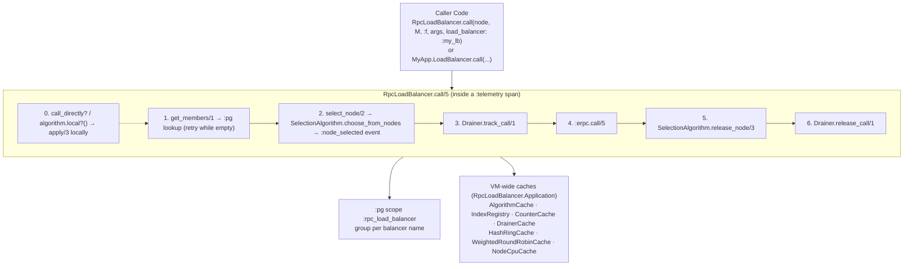
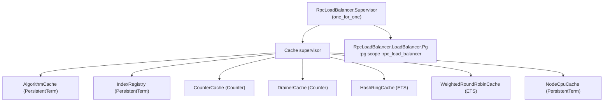
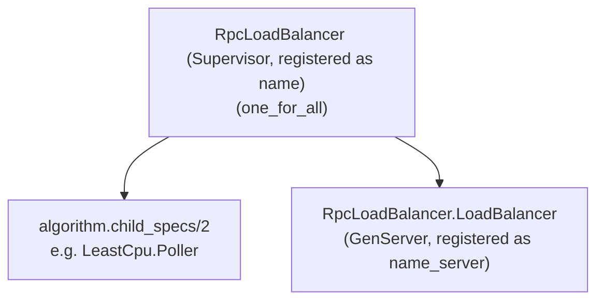

# Architecture and Design Decisions

This document explains the internal architecture of `rpc_load_balancer`, the reasoning behind key design choices, and how the components fit together.

## Why this library exists

Erlang's `:erpc` module provides low-level RPC primitives, but using it directly in application code has friction:

- **No structured errors** — `:erpc` raises Erlang exceptions that need to be caught and translated into meaningful application errors
- **No node management** — callers must know which nodes exist and pick one themselves, and `Node.list/0` keeps dead nodes around until the net-kernel heartbeat notices
- **No load distribution** — without a selection layer, traffic tends to concentrate on whichever node the caller happens to target

`rpc_load_balancer` addresses all three by wrapping `:erpc` with `ErrorMessage` tuples, providing automatic membership via `:pg`, and offering pluggable selection algorithms.

## System overview

```mermaid
flowchart TD
    A["Caller Code\nRpcLoadBalancer.call(node, M, :f, args, load_balancer: :my_lb)\nor MyApp.LoadBalancer.call(...)"] --> B

    subgraph B["RpcLoadBalancer.call/5  (inside a :telemetry span)"]
        B0["0. call_directly? / algorithm.local?() → apply/3 locally"]
        B1["1. get_members/1 → :pg lookup (retry while empty)"]
        B2["2. select_node/2 → SelectionAlgorithm.choose_from_nodes → :node_selected event"]
        B3["3. Drainer.track_call/1"]
        B4["4. :erpc.call/5"]
        B5["5. SelectionAlgorithm.release_node/3"]
        B6["6. Drainer.release_call/1"]
        B0 -.-> B1 --> B2 --> B3 --> B4 --> B5 --> B6
    end

    B --> C[":pg scope :rpc_load_balancer\ngroup per balancer name"]
    B --> D["VM-wide caches (RpcLoadBalancer.Application)\nAlgorithmCache · IndexRegistry · CounterCache · DrainerCache\nHashRingCache · WeightedRoundRobinCache · NodeCpuCache"]
```

## Component design

### RPC wrappers and public API (`RpcLoadBalancer`)

The top-level module serves three roles: it is the public API for RPC operations, the per-instance Supervisor started via `start_link/1`, and the `use` macro that stamps out named balancer modules. It wraps `:erpc.call/5` and `:erpc.cast/4` in `try/rescue` and maps Erlang errors to `ErrorMessage` structs:

- `{:erpc, :timeout}` → `ErrorMessage.request_timeout/2`
- `{:erpc, :noconnection}` → `ErrorMessage.service_unavailable/2`
- `{:erpc, :badarg}` → `ErrorMessage.bad_request/2`
- Anything else → `ErrorMessage.service_unavailable/2`

This gives callers a consistent `{:ok, result} | {:error, %ErrorMessage{}}` contract without needing to understand `:erpc` internals.

When `call/5` or `cast/5` receives a `:load_balancer` option, it routes through the named balancer: check for a local short-circuit (`call_directly?` or a `local?/0` algorithm such as `CallDirect`), select a member, track the in-flight call for draining, execute the RPC, release the node back to the algorithm, and untrack the call. If the `:pg` group is empty it retries via `RpcLoadBalancer.Retry` before giving up — see below. Without the option, it performs a direct `:erpc` call to the specified node.

Every `call/5`/`cast/5` is wrapped in a `:telemetry.span/3` under `[:rpc_load_balancer, :rpc]`, and every selection emits `[:rpc_load_balancer, :node_selected]`. `RpcLoadBalancer.Metrics` turns those into `Telemetry.Metrics` definitions.

### `use RpcLoadBalancer`

The macro is deliberately thin: it stores the `use` options in a module attribute and defines `child_spec/1`, `start_link/1`, and delegating wrappers that inject `load_balancer: __MODULE__` (or pass `__MODULE__` as the name). There is no extra process or registry — the module name simply *is* the balancer name, so the plain API and the module API are interchangeable.

### Load balancer GenServer

Each `RpcLoadBalancer.LoadBalancer` instance is a GenServer that, in `init/1`:

1. Seeds the `IndexRegistry` counters for `DrainerCache` and `CounterCache` and registers its own drainer slot
2. Records the algorithm module in `AlgorithmCache` and runs the algorithm's `init/2`
3. Joins the `:pg` group under the balancer name — **if** `node_match_list` matches the local node
4. Subscribes to membership changes with `:pg.monitor/2` (OTP 25.1+; older OTP runs without join/leave callbacks)

`init/1` does this work directly rather than in `handle_continue/2` on purpose: `start_link/1` returning means "this node is registered and selectable", which is what supervision-tree consumers expect. All of it is local and fast (`:pg.join/3` is a local write that replicates asynchronously).

Join/leave notifications are forwarded to the algorithm's `on_node_change/2`. On `terminate/2` the server leaves the `:pg` group first, then blocks in `Drainer.drain/2` (up to `drain_timeout`, default 15 s) so in-flight calls finish before the process exits.

The GenServer holds minimal state: the algorithm module, the node match list, the `:pg` monitor reference, and the drain timeout. All shared mutable state (counters, weights, hash rings, CPU readings) lives in VM-wide caches — the GenServer is never on the read path, so it can't become a bottleneck.

### Why `:pg` instead of `:global` or a custom registry

`:pg` was chosen because:

- **Distributed by default** — process groups are replicated across connected nodes automatically
- **No single point of failure** — unlike `:global`, `:pg` doesn't require a leader or lock manager
- **Instant failure detection** — a member is removed the moment its process (or node) dies; there is no heartbeat window
- **Built into OTP** — no external dependencies
- **Scope isolation** — using a named scope (`:rpc_load_balancer`) prevents interference with other `:pg` users

When a load balancer starts on a node, it joins the group. When it stops (or the node goes down), `:pg` removes it. Other balancers with the same name on other nodes see the membership change through their monitor.

### Storage strategy: `:persistent_term` vs ETS vs `:counters`

Everything on the selection hot path is read from a cache, and each cache is chosen by write frequency:

| State | Written | Storage | Why |
|---|---|---|---|
| Algorithm module per balancer | once at start | `AlgorithmCache` (`Cache.PersistentTerm`) | read on every call, never changes |
| Algorithm config (`weights`, hash-ring `weight`, `LeastCpu` opts) | once at `init/2` | `:persistent_term`, keyed `{Module, lb_name, key}` | write-once is exactly what PT is for |
| Key → counter index mappings | once per new key | `IndexRegistry` (`Cache.PersistentTerm` + `:atomics`) | rare, monotonic |
| Round-robin cursors, connection counts | every selection | `CounterCache` (`Cache.Counter` → `:counters`) | lock-free atomic add/get |
| In-flight call counts | every call | `DrainerCache` (`Cache.Counter`) | same |
| Built hash ring | every membership change | `HashRingCache` (`Cache.ETS`, raw `lookup`/`insert_raw`) | PT writes trigger a global GC; ETS writes are local |
| Weighted RR expanded list | every membership change | `WeightedRoundRobinCache` (`Cache.ETS`, raw) | same |
| CPU reading per node | every poll (seconds) | `NodeCpuCache` (`Cache.PersistentTerm`) | writes are rare vs. millions of reads; node-keyed so all balancers share |

Two rules fall out of this:

- **`:persistent_term` only for write-once or write-rarely data.** `:persistent_term.put/2` forces a global GC sweep. Membership churn in a large cluster is continuous, so anything rebuilt on `on_node_change/2` goes in ETS.
- **Hot-path reads bypass `elixir_cache`'s telemetry wrapper.** The generated `get/1` wraps every read in `:telemetry.span/3` (~1–2 μs and a shared handler-table lookup). The caches expose raw accessors — `CounterCache.get_node_count/2` → `:counters.get/2`, `HashRingCache.get_ring/1` → `:ets.lookup/2`, `NodeCpuCache.get_cpu/1` → adapter get — for the selection path, and keep the wrapped API for cold paths. `bench/README.md` has the before/after numbers (up to 14× on `HashRing`).

### Application-level vs per-instance supervision

Caches are **VM-wide** and owned by the application supervisor (`lib/rpc_load_balancer/application.ex`), not by each balancer's supervisor. Their lifetime is bound to the VM, so a balancer crashing and restarting doesn't wipe counters or rings, and multiple balancers can share (`NodeCpuCache`, `CounterCache`). The application starts the core caches plus the union of every built-in algorithm's `caches/0`.

The per-instance supervisor holds only what belongs to that balancer: the algorithm's `child_specs/2` (e.g. the `LeastCpu` poller) and the `LoadBalancer` GenServer.

### Node filtering and exclusions

`:node_match_list` decides whether the current node registers as a target. It is a purely local decision — every node evaluates it against its own name; there is no coordinator. Nodes that don't match still run the balancer supervisor and can select and call, they just aren't selectable.

All name matching goes through `RpcLoadBalancer.NodeFilter.matches?/2,3`, which adds one rule on top of `=~`: `excluded_node_patterns` (config, default `[]`). A node whose short name contains an excluded substring — say `_qa` — is dropped from any filter that doesn't itself contain `_qa`. This lets a `"worker"` filter reach production workers but not `worker_qa@…`, while `"worker_qa"` still reaches them, without every call site having to know about the QA naming scheme. The same function backs the `node_filter` argument of the random-node helpers.

### Retry on no route

Cluster boot and rolling restarts routinely produce a window where a balancer's group is empty or no node matches a filter. Failing instantly would push a retry loop into every caller. Instead the two entry points that can hit "nobody to talk to" — load-balanced `call/5`/`cast/5` and the random-node helpers — run their dispatch inside `RpcLoadBalancer.Retry.with_retry/2`: the dispatch function returns `:retry` only for the empty-pool case, and the loop sleeps `retry_sleep` between attempts up to `retry_count` (or `:infinity`).

Only the empty-pool condition is retried. Once an RPC is dispatched its outcome is final; retrying timeouts or remote errors would risk running side-effecting work twice.

### Connection draining

The `Drainer` module tracks in-flight calls using an atomic counter per load balancer name. When a load-balanced `call/5` or `cast/5` executes, the counter is incremented before the RPC and decremented after (in an `after` block to ensure cleanup on errors). During shutdown, the GenServer's `terminate/2` leaves `:pg` and then calls `Drainer.drain/2`, which polls the counter every 50 ms until it reaches zero or the timeout expires.

This is why the balancer should be the last child in the consuming application's supervision tree: OTP stops children in reverse order, so the balancer deregisters and drains *before* the repo, endpoint, or whatever the RPC handlers depend on goes away.

The random-node helpers can opt into the same tracking by passing `load_balancer:` — that only affects draining, not selection. Doing so on a node that never started a balancer with that name raises a descriptive error from `IndexRegistry` (the counter was never seeded).

### Random-node helpers

`call_on_random_node/5` and `cast_on_random_node/5` provide a simpler routing mechanism that doesn't require a load balancer instance: filter `Node.list/0` by name and pick a random match. They are useful for "any node of type X" calls where zero setup matters more than the instant dead-node removal `:pg` membership provides. If the current node matches the filter or `:call_directly?` is true, they execute locally.

## Algorithm design

### The behaviour pattern

All algorithms implement a single required callback (`choose_from_nodes/3`) plus optional lifecycle callbacks (`init/2`, `choose_nodes/4`, `on_node_change/2`, `release_node/2`, `local?/0`, `child_specs/2`, `caches/0`). This keeps simple algorithms simple (`Random` is one function) while letting stateful algorithms hook the full lifecycle — up to running their own supervised processes.

The `SelectionAlgorithm` module acts as a dispatch layer that checks `function_exported?/3` before calling optional callbacks, so algorithms only implement what they use. It also owns the selection telemetry, so custom algorithms are instrumented for free.

### Counter-based algorithms

`LeastConnections`, `PowerOfTwo`, and `RoundRobin` all use `:counters`. The key design choice is that **selection and counter update are not transactional** — there's a window between reading a count and incrementing it where another process could read the same value.

This is acceptable because:

- Perfect accuracy isn't required — load balancing is probabilistic
- The atomic increment itself is safe — no count is lost
- The alternative (locking) would add latency on every selection and serialize the hot path

### Counter overflow protection

`RoundRobin` and `WeightedRoundRobin` reset their cursor when it exceeds 10,000,000. The reset is not atomic with the read, but since the cursor is used modulo the list length, a brief discontinuity has no practical impact.

### HashRing design

`HashRing` delegates to [`libring`](https://hex.pm/packages/libring), which implements a consistent hash ring using `:erlang.phash2/2` over a 2^32 range and a `gb_tree` for O(log n) lookups. Each physical node is sharded into 128 points (configurable via `:weight`).

Key design decisions:

- **`libring` over a custom implementation** — well-tested, handles hashing, ring storage, and weighting; removes the need for custom binary search and vnode management
- **Lazy ring rebuilding** — `on_node_change/2` deletes the cached ring; the next `choose_from_nodes/3` rebuilds it from the current member list. A burst of joins/leaves costs one rebuild
- **Ring in ETS, weight in `:persistent_term`** — see the storage table above
- **Minimal key redistribution** — adding a node moves ~1/N of keys; removing one moves only its own keys to their clockwise neighbours
- **Replica selection via `choose_nodes/4`** — `libring`'s `key_to_nodes/3` walks the ring to N distinct physical nodes, so a key always maps to the same ordered replica set

### LeastCpu design

CPU is the one signal that can't be derived from the balancer's own activity, so `LeastCpu` is the one algorithm with a background process. Its constraints shaped the design:

- **Selection never blocks on the network.** The `Poller` samples local CPU and fetches remote readings with `:erpc.multicall/5` (parallel, per-call 2 s timeout) on an interval; `choose_from_nodes/3` only reads the cache. Missing or stale entries read as a neutral 50%.
- **Node-keyed, not balancer-keyed cache.** CPU is a property of the node. One `NodeCpuCache` entry per node lets every `LeastCpu` balancer in the VM share and co-warm the data — and it's why the algorithm deliberately does *not* implement `on_node_change/2`: one balancer losing a member must not delete a reading another balancer still uses. Stale entries age out via `cpu_cache_ttl`.
- **Threshold band, not strict minimum.** Picking randomly among nodes within `cpu_threshold` of the minimum avoids herding every caller onto the single coldest node between polls.
- **Startup jitter.** A cluster-wide deploy would otherwise fire N simultaneous multicalls; the first poll is delayed by a random `[0, poll_startup_jitter]`.
- **`:cpu_sup` over scheduler wall time.** `:erlang.system_flag(:scheduler_wall_time, true)` is a VM-global side effect with measurable overhead; `:os_mon` samples the OS with no global flag.

## Error handling philosophy

The library uses the `ErrorMessage` library consistently:

- All public functions return `{:ok, result}`, `:ok`, or `{:error, %ErrorMessage{}}` tuples
- Error codes map to HTTP status semantics (`:service_unavailable`, `:request_timeout`, `:bad_request`)
- Error details include the node name and any relevant context in the `:details` field

This design integrates cleanly with Phoenix applications that can pattern-match on `ErrorMessage` codes for HTTP response mapping.

## Supervision trees

### Application supervisor

Started automatically when the application boots:

```mermaid
flowchart TD
    S["RpcLoadBalancer.Supervisor\n(one_for_one)"] --> C["Cache supervisor"]
    S --> PG["RpcLoadBalancer.LoadBalancer.Pg\n:pg scope :rpc_load_balancer"]
    C --> AC["AlgorithmCache (PersistentTerm)"]
    C --> IR["IndexRegistry (PersistentTerm)"]
    C --> CC["CounterCache (Counter)"]
    C --> DC["DrainerCache (Counter)"]
    C --> HR["HashRingCache (ETS)"]
    C --> WR["WeightedRoundRobinCache (ETS)"]
    C --> NC["NodeCpuCache (PersistentTerm)"]
```

### Per-instance supervisor

Each `RpcLoadBalancer.start_link/1` (or `use RpcLoadBalancer` module) starts a Supervisor for one load balancer instance:

```mermaid
flowchart TD
    S["RpcLoadBalancer (Supervisor, registered as name)\n(one_for_all)"] --> AL["algorithm.child_specs/2\ne.g. LeastCpu.Poller"]
    S --> GS["RpcLoadBalancer.LoadBalancer\n(GenServer, registered as name_server)"]
```

Algorithm children start first so they exist by the time the GenServer registers and callers can `select_node/2`. The strategy is `:one_for_all` — if either crashes, the instance restarts together; the VM-wide caches are untouched.

Load balancer instances are expected to be added to the consuming application's supervision tree — last, for the draining reason above.

## Multi-node behaviour

On a cluster with N nodes, each running a load balancer with the same name:

1. Each node's GenServer joins the shared `:pg` group (subject to `node_match_list`)
2. Each node sees all registered members (including itself, if it registered)
3. `select_node/2` on any node can return any member
4. RPC calls execute on the selected node via `:erpc`

The load balancer is fully symmetric — there's no primary/replica distinction. Every node is a selector, and every node that matches `node_match_list` is also a target.
